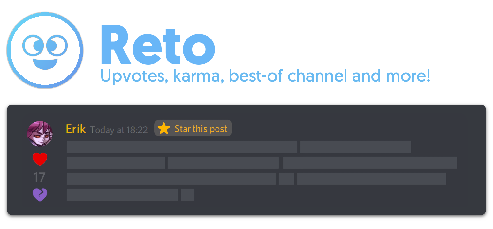

## 🤖 Reto
> Reto is a community-oriented Discord bot, featuring a karma system, a way to reward the best comments, leaderboards, and so much more! React to a post with the `plus` or `minus` emojis to give said user some points for their content. `Curators` can even star (react with the exclusive `10` emoji) posts to give them extra points, and add their comment to a special "Best Of" channel for all to admire!

## ⚙️ Features
`The bot's default prefix is "?".`
- Look at your own (or others') karma by checking your **?profile**.
- Duke it out and see who has the most points on the **?leaderboard**. `?globalleaderboard`
- Or maybe check the best-rated comments on the **?postleaderboard**!  `?globalpostleaderboard`
- Change how the reaction emojis look with **?emoji edit**.
- Set up _Reddit-like_ automatic reactions in any channel using **?autovote**.
- These are just the main ones - check out the entire command list with **?help**!

## 👨‍💻 Self-hosting Reto
Want to host Reto on your own machine? [Read this guide](https://github.com/despedite/reto/wiki/Self-hosting-Reto) on how to do exactly that!
